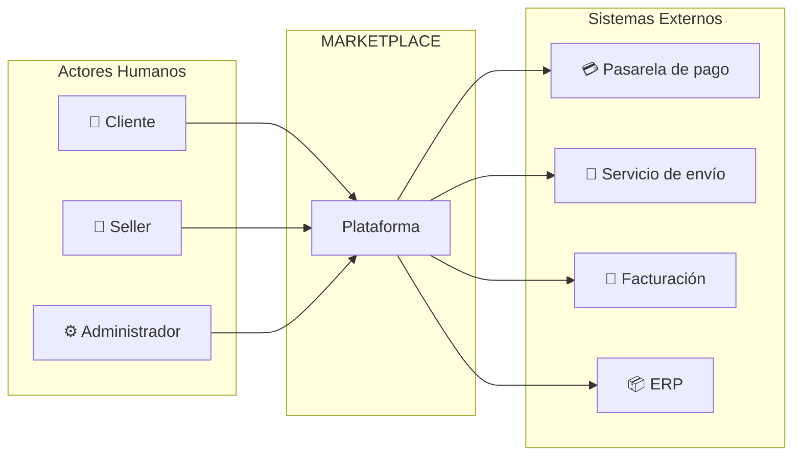

# 01. Actores del sistema

Los actores son personas, organizaciones o sistemas externos que están fuera del sistema y que interactúan con él.

## Actores humanos

| Actor | Tipo | ¿Qué necesita realizar? |
|:---|:---|:---|
| **Cliente** | Primario | Buscar productos, consultar información, agregar productos al carrito, realizar pedidos, efectuar el pago y consultar sus pedidos. |
| **Seller** | Primario | Ofrecer productos, registrar productos, actualizar productos, consultar sus productos y gestionar la información relacionada con sus ventas. |
| **Administrador** | Primario | Administrar la plataforma (gestionar sellers, clientes, categorías y monitorear el funcionamiento del sistema). |

## Sistemas externos

| Actor | Tipo | ¿Qué necesita realizar? |
|:---|:---|:---|
| **Pasarela de pago** | Externo | Procesar pagos y confirmar la autorización de las operaciones de compra. |
| **Servicio de envío** | Externo | Gestionar la información de entrega de los pedidos (estados, guías, seguimiento). |
| **Servicio de facturación** | Externo | Generar comprobantes de pago por cada operación realizada. |
| **ERP** | Externo | Proporcionar información de productos y stock a la plataforma. |

## Diagrama de actores

