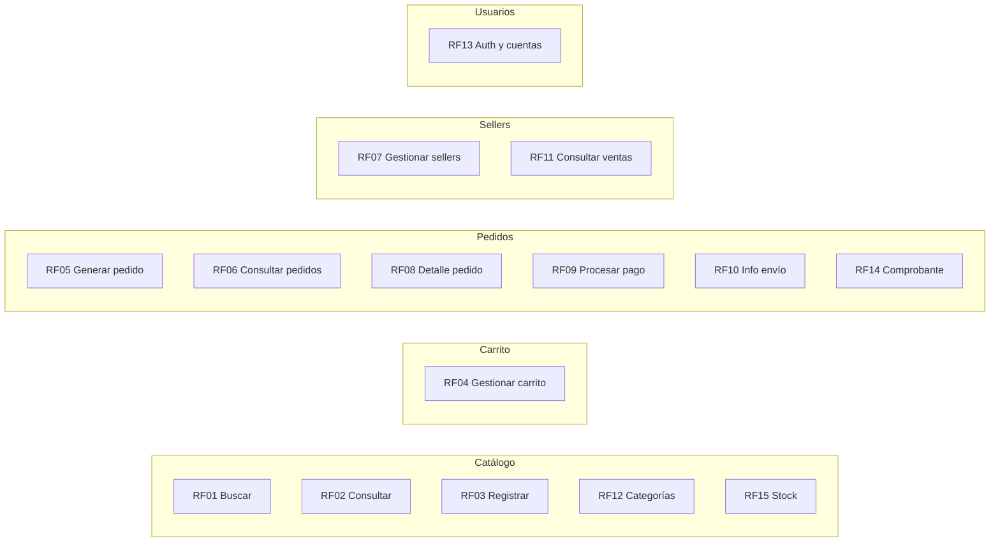

# 03. Requisitos funcionales

## Lista de requisitos

| ID | Requisito funcional | Prioridad | Módulo |
|:---|:---|:---|:---|
| RF01 | El sistema debe permitir buscar productos mediante criterios de búsqueda. | Alta | Catálogo |
| RF02 | El sistema debe permitir consultar la información y disponibilidad de los productos. | Alta | Catálogo |
| RF03 | El sistema debe permitir registrar y actualizar productos en la plataforma. | Alta | Catálogo |
| RF04 | El sistema debe permitir agregar, modificar y eliminar productos del carrito de compra. | Alta | Carrito |
| RF05 | El sistema debe permitir generar un pedido a partir de los productos del carrito. | Alta | Pedidos |
| RF06 | El sistema debe permitir consultar los pedidos realizados y su estado. | Media | Pedidos |
| RF07 | El sistema debe permitir registrar, actualizar y desactivar sellers de la plataforma. | Alta | Sellers |
| RF08 | El sistema debe permitir consultar el detalle de un pedido realizado. | Media | Pedidos |
| RF09 | El sistema debe permitir procesar el pago de un pedido mediante una pasarela de pago externa. | Alta | Pedidos |
| RF10 | El sistema debe permitir registrar y consultar la información de envío de un pedido. | Media | Pedidos |
| RF11 | El sistema debe permitir consultar las ventas asociadas a los productos de un seller. | Media | Sellers |
| RF12 | El sistema debe permitir gestionar las categorías de productos del catálogo. | Media | Catálogo |
| RF13 | El sistema debe permitir registrar, autenticar y administrar cuentas de usuario. | Alta | Usuarios |
| RF14 | El sistema debe permitir generar comprobantes de pago por cada operación de compra. | Media | Pedidos |
| RF15 | El sistema debe permitir consultar y actualizar el stock de los productos. | Alta | Catálogo |

## Relación entre HU y requisitos funcionales

| Historia de usuario | Requisitos funcionales relacionados |
|:---|:---|
| HU01 Buscar y consultar productos | RF01, RF02 |
| HU02 Gestionar productos | RF03, RF15 |
| HU03 Gestionar carrito | RF04 |
| HU04 Realizar pedido | RF05, RF08 |
| HU05 Gestionar sellers | RF07 |
| HU06 Consultar pedidos | RF06, RF08 |
| HU07 Realizar pago | RF09, RF14 |
| HU08 Consultar envío | RF10 |
| HU09 Consultar ventas | RF11 |
| HU10 Gestionar categorías | RF12 |
| HU11 Monitorear sistema | RF13 |

## Requisitos por módulo

