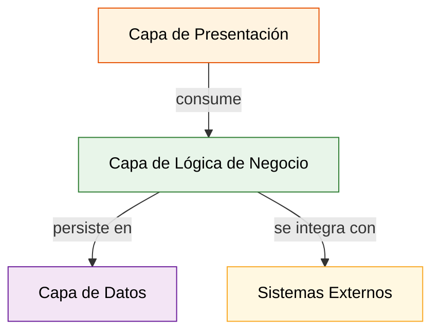
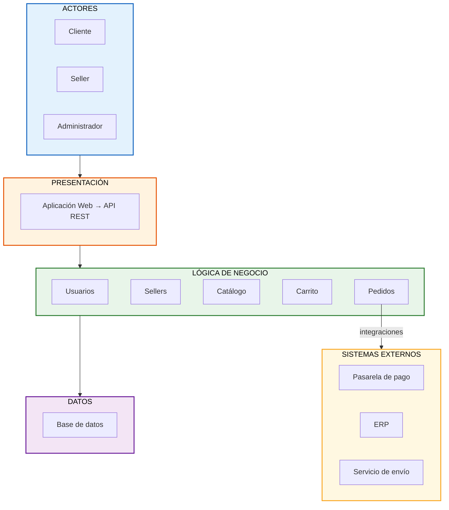

# Arquitectura inicial del sistema

## Descripción

La arquitectura inicial se organiza en tres capas principales:

- **Presentación:** permite la interacción de los usuarios con el sistema mediante la aplicación web y la API REST.
- **Lógica de negocio:** contiene los principales módulos responsables de las funcionalidades del sistema: usuarios, sellers, catálogo, carrito y pedidos.
- **Datos:** permite almacenar y consultar la información mediante una base de datos.

Además, el módulo de **Pedidos** se integra con sistemas externos como la **pasarela de pago**, el **servicio de envío** y el **ERP**.

Cada capa tiene sus propias responsabilidades y se comunica con la capa inmediatamente inferior.

## Módulos por capa

| Capa | Pregunta que responde | Módulos / elementos |
|:---|:---|:---|
| Presentación | ¿Cómo interactúa el usuario? | Aplicación Web, API REST |
| Lógica de negocio | ¿Qué hace el sistema? | Usuarios, Sellers, Catálogo, Carrito, Pedidos |
| Datos | ¿Dónde se almacena la información? | Base de datos (PostgreSQL) |
| Sistemas externos | ¿Con qué se integra? | Pasarela de pago, Servicio de envío, ERP, Facturación |

## Responsabilidades por módulo

| Módulo | Responsabilidad principal | Requisitos funcionales |
|:---|:---|:---|
| **Usuarios** | Gestionar autenticación, registro y administración de cuentas de usuarios del sistema. | RF13 |
| **Sellers** | Gestionar el registro, actualización y desactivación de vendedores, y consultar sus ventas. | RF07, RF11 |
| **Catálogo** | Gestionar productos, categorías, búsqueda, consulta de disponibilidad y stock. | RF01, RF02, RF03, RF12, RF15 |
| **Carrito** | Gestionar los productos seleccionados por el cliente antes de generar el pedido. | RF04 |
| **Pedidos** | Gestionar la generación de pedidos, procesamiento de pago, información de envío y comprobantes. | RF05, RF06, RF08, RF09, RF10, RF14 |

## Dependencias entre capas

## Diagrama de arquitectura (Mermaid)

## Diagrama interactivo (Archify)

Para una versión interactiva con zoom, búsqueda, trazado de relaciones y vistas guiadas, consultar:

- **HTML explorable:** [marketplace-arquitectura.html](marketplace-arquitectura.html)
- **Especificación JSON:** [marketplace-arquitectura.architecture.json](marketplace-arquitectura.architecture.json)
